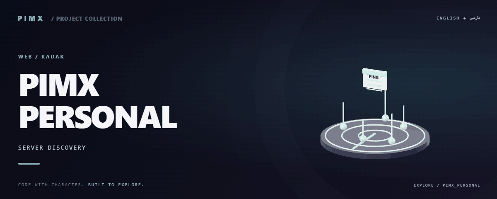

<div align="center">



**[English](README.md) · [فارسی](README.fa.md)**


</div>

# PIMX PERSONAL

A React server-discovery dashboard with a Node backend for collecting, testing and listing proxy/server configurations. The source is a network tool despite the repository name.

[GitHub](https://github.com/MOHAMMADREZAABEDINPOOR/PIMX_PERSONAL) · [PIMX / Profile](https://github.com/MOHAMMADREZAABEDINPOOR) · [Static artwork](assets/readme/hero.png)

## Features

- Server cards with copy controls and availability information
- Backend collection, parsing and batch testing
- Theme controls and Persian usage guidance
- Node backend plus optional Cloudflare adapters

## Stack

| Tool | Version / source |
|---|---|
| React | `^19.2.1` |
| Vite | `^6.2.0` |
| TypeScript | `~5.8.2` |

## Getting started

Node.js 22.12+ and the package manager declared in package.json. Install dependencies from the checked-in lockfile where available.

```bash
git clone https://github.com/MOHAMMADREZAABEDINPOOR/PIMX_PERSONAL.git
cd PIMX_PERSONAL

npm ci
npm --prefix backend install
npm run dev
# In a second terminal
npm run backend
```

## Configuration

These names are found in the example configuration or source; not all are required. Check their defaults/usage in those files and supply secrets only in your local or hosting environment.

| Name | Role |
|---|---|
| `API_KEY` | Credential/connection setting; keep private |
| `BACKEND_URL` | Application setting; inspect its definition |
| `GEMINI_API_KEY` | Credential/connection setting; keep private |
| `PORT` | Application setting; inspect its definition |

Hosting bindings: `SERVERS_KV`.

## Usage

Run both the frontend and backend, refresh the scan and copy a listed configuration into a compatible client. Review the API base URL in the frontend service for your environment.

## Project structure

| Path | Role |
|---|---|
| [`assets/`](assets/) | Brand/media/README assets |
| [`components/`](components/) | Reusable interface components |
| [`functions/`](functions/) | Hosting API functions |
| [`public/`](public/) | Public web assets |
| [`services/`](services/) | Services and integration helpers |
| [`src/`](src/) | Application source |
| [`index.html`](index.html) | Project entry/configuration file |
| [`metadata.json`](metadata.json) | Project entry/configuration file |
| [`netlify.toml`](netlify.toml) | Project entry/configuration file |
| [`package.json`](package.json) | Project entry/configuration file |
| [`tsconfig.json`](tsconfig.json) | Project entry/configuration file |
| [`vercel.json`](vercel.json) | Project entry/configuration file |
| [`wrangler.toml`](wrangler.toml) | Project entry/configuration file |

## Commands and checks

```bash
npm run dev
npm run build
npm run preview
npm run start
```

These commands are declared in package.json; the list is not a test execution report. Test commands may need a browser, service or prepared database.

## Deployment

Deploy the build according to its architecture: server-backed projects need a Node process; static Vite frontends can host dist. Pages functions, KV or D1 require separate configuration.

## Limitations

Public configurations can become unavailable or untrusted. Test results reflect the scanner location, not guaranteed access from your device. Static hosting needs a separately hosted API.

## Troubleshooting

- Missing packages: install dependencies using the project’s package manager.
- API/network failure: check the configured origin, provider and hosting bindings.
- Old assets: rebuild when a build script exists, then clear the browser cache.

## Contributing

Create a focused branch, verify the affected behavior and explain the change clearly. Keep private data, build outputs and local databases out of commits.

## License

No repository-level license file is included in this snapshot. Public visibility alone does not grant reuse rights; contact the repository owner for terms.

---

Part of **PIMX** · Documentation in English and Persian.
